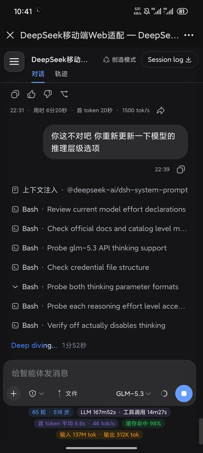
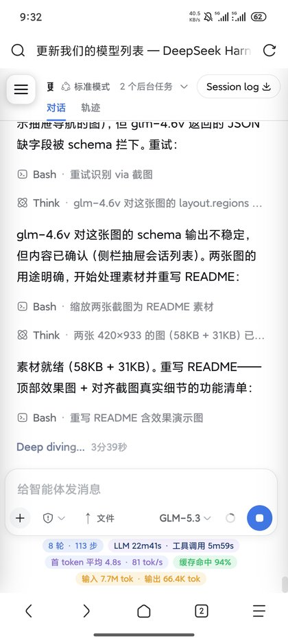
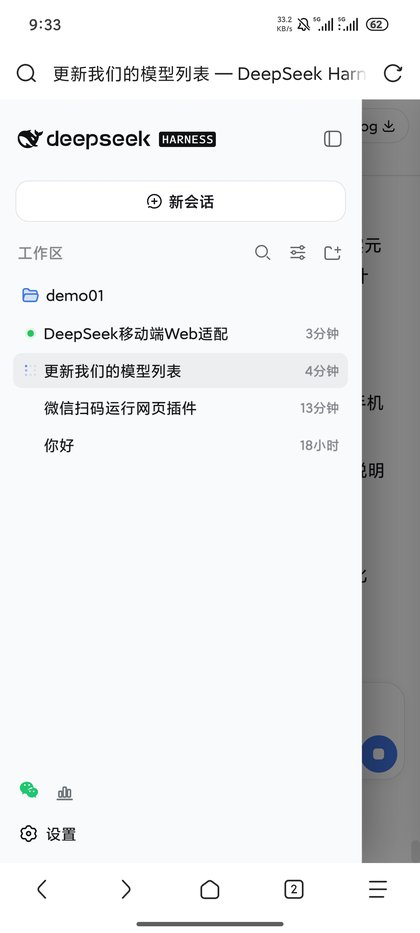

# dsh-mobile-ui

[](./LICENSE)
[](#兼容性)
[](./CHANGELOG.md)

DSH（DeepSeek Harness）Web GUI 的**移动端适配插件**：手机浏览器打开页面即得原生 App
般的单列对话体验，桌面端布局不受任何影响。零配置、零依赖、纯客户端注入。

专为**微信内置浏览器**与 Android/iOS 浏览器调校——在手机上挂着 DSH 服务、
随时随地用手机续写会话的场景而设计。

## 效果演示

| 微信内置浏览器 · 对话界面 | Via 浏览器 · 轨迹视图 |
|:---:|:---:|
|  |  |
| 单列布局 · 统计胶囊 · 输入防溢出 | 工具时序 · 思考块 · 全套统计 |

左图：对话主界面自动单列化，底部统计行按"轮次/步数/LLM 耗时/工具耗时"
分组胶囊着色，输入区不再溢出。
右图：轨迹视图收纳工具调用时序与思考块，首 token / 速率 / 缓存命中 /
输入输出 token 全套统计小屏不截断。

**会话管理（☰ 抽屉）**

<p align="center">
  
</p>

右下角 ☰ 悬浮按钮唤出会话侧栏：搜索、新会话、文件夹分组、相对时间标记，
遮罩点击关闭。

## 功能特性

### 布局
- **单列布局** —— 桌面双栏（侧栏+主区）在窄屏压成单列，内容区占满全宽
- **抽屉导航** —— ☰ 悬浮按钮唤出会话侧栏，跟随官方 `data-sidebar-collapsed`
  状态，不自建状态机，与桌面端行为一致
- **工具详情抽屉** —— 点工具卡片"检查"按钮弹出底部详情抽屉（移动端无官方入口），
  面板自身的关闭按钮与 Esc 键同步收起
- **滚动锁定** —— 抽屉打开时背景页面不再跟着滚（`overflow:hidden` +
  `overscroll-behavior:contain` 防滚动穿透）
- **拖拽手柄隐藏** —— 触屏无处拖的分割条全部隐藏
- **全局隐藏滚动条** —— 手机层滚动滑轨一律消失（触摸/滚轮滚动不受影响），
  各滚动面板收回 8-15px 地沟宽度，不再有可误拖的滑块

### 输入区
- **防溢出** —— composer 工具行/模型名自动换行收缩，不再一行挤爆
- **禁 iOS 聚焦缩放** —— 输入控件统一 16px 字号
- **底部安全区** —— `env(safe-area-inset-bottom)` 正确留白，不再被手势条遮挡
- **键盘适配** —— viewport 追加 `interactive-widget=resizes-content`，Android 软键盘
  弹出时视口收缩，composer 不被遮挡；横屏刘海侧安全区同样留白

### 观感
- **统计胶囊** —— 底部 token/耗时统计按组着色、胶囊化排列，小屏不截断
- **轨迹统计收纳** —— 首 token / 速率 / 缓存命中 / 输入输出 token 整行显示，不溢出换行
- **消息时间行** —— "时间 · 用时 · 首 token · 速率"整行收纳，不再溢出换行
- **各类标签着色** —— 工具标签、上下文注入标签等 6 处恢复语义配色
- **弹层居中** —— 定时任务等 flyout 菜单在窄屏居中弹出
- **插件市场适配** —— dshmarket 五个标签页收进单列：标签条横滑、搜索框占满、
  横幅按钮换行、卡片网格自适应窄容器、已装行来源/按钮换行、备份核对行堆叠、
  安装/卸载弹窗近全屏且高度按视口封顶

## 安装

**方式一 · 插件控制台（推荐）**：在 DSH Web 的插件控制台中按 GitHub 源安装本仓库。

**方式二 · 手动安装**：克隆本仓库到本地，`~/.dsh/profiles/web/package.json` 的 dependencies 增加 `"dsh-mobile-ui": "file:<克隆路径>"`，并在 `node_modules/` 下建立对应符号链接。

在 `cordis.patch.yml` 挂载：

```yaml
- insert:
    - id: mobile-ui
      name: 'dsh-mobile-ui'
```

重启 dsh web，手机访问即生效。验证：

```sh
curl -s -o /dev/null -w "%{http_code}\n" \
  "http://127.0.0.1:3080/plugins/dsh-mobile-ui/client.js"   # 期望 200
```

## 架构

```
lib/index.js    host 半边（空实现，仅占位——本插件纯客户端）
lib/client.js   client 半边（ModuleLoader 自注册格式）
                ├─ styles: MOBILE_CSS（全部适配样式，4 组媒体查询断点）
                ├─ 帧状态镜像: MutationObserver 给抽屉列打 [data-dshm-col] 标签，
                │  官方 sidebar 状态单向同步到 body[data-mob-sidebar-open]，
                │  抽屉打开时置 body[data-mob-lock]（CSS 零 :has() 依赖）
                ├─ shell.overlay 槽位: ☰/详情 FAB + 遮罩
                ├─ document click 监听: 点工具"检查"→开详情抽屉
                └─ 3s 自检: rc6 锚点类全缺时 console.warn 提示跑 refresh-hashes
                （状态查 window.__dshMobileUi）
```

适配策略分两层，升级 dsh 时命运不同：

| 层 | 钩子示例 | 升级 dsh 后 |
|---|---|---|
| **稳定钩子** | `data-sidebar-collapsed`、`data-slot='sidebar'`、`env(safe-area-inset-*)` | 一般继续生效 |
| **构建 hash 类名** | `.uV2eYG_*`、`.FJxK0a_*` 等（跟随构建产物） | 可能失效，需刷新 |

### 断点分层（本插件 vs 官方内置响应式）

| 层 | 断点 | 内容 |
|---|---|---|
| 本插件 | ≤820px | 单列布局、抽屉导航、details 抽屉、composer 收纳、统计胶囊、安全区 |
| 官方 trajectory | ≤760px | 轨迹 details 面板变右侧浮层 |
| 官方 user-questions | ≤720px | 计划评审卡圆角/内边距 |
| 官方 plugin-inventory | ≤680px | 设置页插件卡网格单列 |
| 官方 settings-models / workflow-run | ≤560px | 弹窗内边距收紧 |

官方查询均为组件级微调、无全局抽屉逻辑，与本插件不冲突；681–820px（平板竖屏）
区间只有本插件生效。

## 兼容性与 hash 维护

基于 dsh `0.1.0-rc.6` 构建。升级 dsh 后若手机上出现布局回退（输入框挤爆、
统计变灰一行、侧栏变 56px 窄条、点"检查"无反应等），说明 hash 已过期：

```sh
node tests/run-tests.cjs     # 第 4/5 节报告 hash 存活情况
```

刷新方法（推荐 · 自动）：

```sh
node scripts/refresh-hashes.mjs            # 干跑：报告新旧前缀映射与存活状态
node scripts/refresh-hashes.mjs --write    # 应用整前缀替换并校验新类名存在于构建产物
```

脚本从已安装的 `dsh-client-ui-*` 包读取类名映射（`{ "logical": "hash" }`）；
仍存活的 token 不动，前缀已死且新值唯一的自动替换，多处候选的明确报告交人工定夺。

刷新方法（手动兜底）：新 hash 藏在 `dsh-client-ui-*` 包的 `lib/client.js` 类名映射
（`var X_default = { "logical": "hash" }`）里，找到逻辑名对应的新前缀，
对 `lib/client.js` 中标注 `rc6` 的段落做**整前缀全局替换**
（如 `uV2eYG_` → 新值），避免逐条手改遗漏。

## 测试

```sh
node tests/run-tests.cjs
# 可选环境变量：
#   DSH_PKGS_DIR   指向 node_modules/@deepseek-ai（默认自动发现 ~/.npm/_npx）
#   DSH_BASE_URL   指向运行中的 dsh web（如 http://127.0.0.1:3080）启用运行时检查
```

56 项静态检查（DSH_BASE_URL 指向运行中的 dsh web 再加 4 项运行时检查，含线上副本
新鲜度守卫）：包形状、client bundle 可执行性、CSS 完整性、hash 存活性、DOM 钩子、
死选择器/:has 回潮防护、color-mix 兜底配对。

## 已知坑（给想写同类插件的人）

1. **package.json 的 exports 会封装整个包**：必须保留 `"./package.json": "./package.json"`，
   否则客户端注册表 `require.resolve("<pkg>/package.json")` 被挡，插件被**静默跳过**
   （无报错、日志干净——最难查的一种失败）。
2. **client.js 必须是 `window.__ModuleLoader__.load({id, factory})` 自注册格式**，
   不是 ESM export；React 从 `require("react")` 取。
3. **nth-of-type 只数标签不看 class**：统计行的组 span 与分隔 span 交替，
   组落在奇数位——CSS 按奇数位着色，别按"第 N 个组"数。
4. **别用 CSS `:has()` 跟随应用状态**：老微信 XWeb 内核（< Chrome 105）不支持，
   且 `body:has(div[style*=...])` 让每次样式重算都全文档扫描。1.2.0 起改由
   MutationObserver 单向镜像官方状态到 body 属性（派生展示位 ≠ 第二状态机，
   不违反"单一状态源"红线）。`color-mix()` 同理：每条 color-mix 声明前都要有
   rgba 兜底，旧内核整条丢弃声明时还有底色。

## License

[MIT](./LICENSE) © [cloudfly-xiao](https://github.com/cloudfly-xiao)
